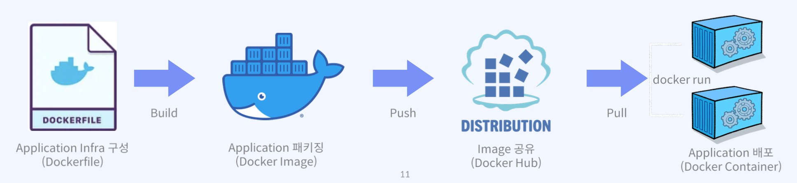

# 컨테이너 기술이란?

- 컨테이너는 애플리케이션을 언제든 실행 가능하도록 필요한 모든 요소를 하나의 런타임 환경으로 패키징한 논리적 공간
  - 모든 요소: 소스코드, 구성요소, 종속성
  - 컨테이너의 인프라를 만드는 것 = 이미지
    - 소스코드, 구성요소, 종속성 등을 하나로 묶어서 실행환경으로 만들어주는 것을 이미지라고 부른다.
    - 이런 이미지를 도커에서는 도커 파일이라고 부른다.
  - 이러한 패키징 기술을 docker에서는 Dockerfile build를 통해 구현한다.
    - 도커 파일에 인프라를 제작하고, 코딩을 하기 때문에 IAC라고 부른다.
  - 이미지와 함께 묶어서 패키징한 논리적 공간이라고 한다
- 애플리케이션과 종속 항목을 하나로 묶어 실행하게 해주는 운영 시스템을 가상화한 경량의 격리된 프로세스라고 볼 수 있다.
  - microVM이라고도 불린다.
  - 운영체제 수준의 가상화 제공
    - 다만, 컨테이너의 운영체제에는 커널이 없다.
    - 커널없이 운영체제는 동작하지 않기 때문에, 도커는 Platform이다. OS 위에 올라가는 Platform as a service 중 하나이다. OS의 커널을 도커 컨테이너가 공유해서 쓰는 기술이다.
  - 독립성을 갖기 때문에 다른 컨테이너에 영향을 주지 않는 stateless(휘발성) 환경 제공
    - 격리 = 독립성
    - 운영체제가 격리되었다는 것은 방화벽과 동일한 역할을 한다는 뜻이다.
      컨테이너 내부에 접근할 때, 포트를 열어주지 않는 경우 컨테이너에 포트를 통해 트래픽을 전달하는 방법이 막히게 된다.
- 컨테이너를 통해 서버 구성, OS 설치, 네트워크, 개발 도구 구성 등의 반복적이고 불편한 작업에 시간을 낭비하지 않고 개발자는 애플리케이션 개발 그 자체에 집중할 수 있게 된다.

# 컨테이너 특징

- 컨테이너는 우리가 개발한 최소한의 이미지를 통해 실행되므로 경량이다.
  - 가장 중요한 것은 도커 파일이며, 도커 파일을 통해 이미지를 생성할 수 있다.
  - 도커 파일에는 인프라가 담겨 있게 된다.
- 일반 서버 환경에서의 애플리케이션 실행과 달리 언제든 프로세스 수준의 속도로 빠르게 실행할 수 있고, 프로세스 수준의 속도로 빠르게 실행할 수 있고, 한 번에 여러 개의 컨테이너를 동시에 실행 가능하다.
  - Docker에서는 docker compose 기술을 통해 구현한다.
- 개인 환경이든 클라우드 환경이든, 어떤 OS, 어떤 환경에서도 동작 가능한 이식성을 보유하고 있다.
- 컨테이너 자체 애플리케이션 환경에 대한 관리만 요구되므로 지속적 서버 관리 비용을 절감할 수 있다.
- 개발팀과 운영팀의 업무 분리로 각자의 업무와 세분화된 관리에 집중할 수 있다. 컨테이너는 DevOps workflow 구성에 최적이다.

# 컨테이너는 어떤 타입으로 생성되는지?

- 컨테이너 패키징 메커니즘: 시스템 컨테이너, 애플리케이션 컨테이너, 라우터 컨테이너

Q. 시스템 컨테이너와 애플리케이션 컨테이너의 구분 방법은?
A. 컨테이너 내부의 주인이 누구인가.

- Host의 PID 1번은 시스템 D 프로세스이다.
- 시스템 컨테이너의 PID 1번은 OS 주체가 된다. (OS PID)
- 애플리케이션 컨테이너의 PID 1번은 컨테이너를 실행한 컨테이너 자체가 1번이 된다.

### 시스템(OS) 컨테이너

- 호스트 OS 위에 Ubuntu와 같은 배포판 리눅스 Image를 통해 배포되는 컨테이너
- 또 다른 VM의 형태이고, 내부에 다양한 애플리케이션 및 라이브러리 도구를 설치, 실행 가능하다.
- 대표적으로 LXC, LXD, OpenVZ, Linux VServer, BSD Jails 등이 있다.

### 애플리케이션 컨테이너

- 단일 애플리케이션 실행을 위해 해당 서비스를 패키징하고 실행하도록 설계된 컨테이너다.
- 3 tier 애플리케이션과 같은 경우 각 tier를 개발 컨테이너로 실행하여 연결
  - 3 tier = frontend + backend + DB
- 대표적으로 Docker container runtime, Rocket 등이 있다.

# 도커란

- 컨테이너를 실행하고 관리하는 container runtime 도구
- 여러 계층의 Application을 container로 분리, 연결하여 실행하는 MSA 프로젝트에 유용
- Application의 Infra(runtime)는 Image를 통해 제공하고 Public, Private하게 공유 가능.
  - demon, 환경 등등의 infra 구축을 Image로 제공한다.
- Github와 유사한 방식으로 Docker Hub에서 제공함
- 이렇게 제공된 Image를 기반으로 Application 서비스를 제공, 이를 컨테이너화 할 수 있다.

