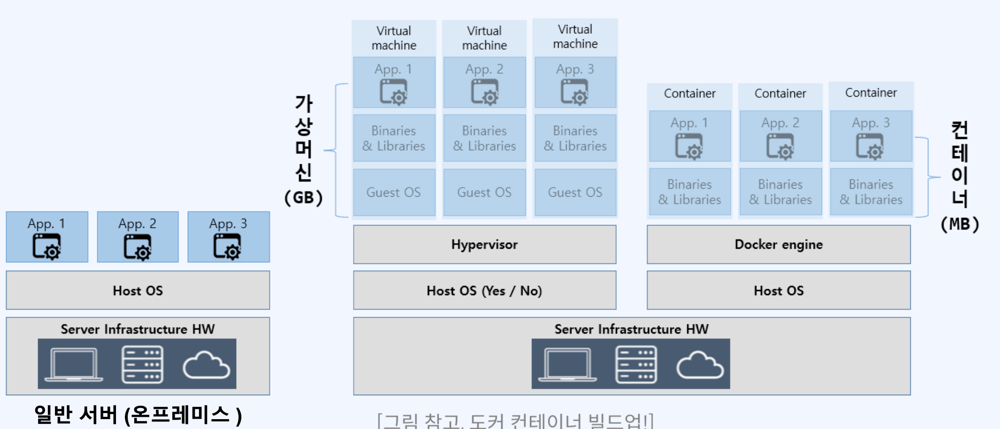
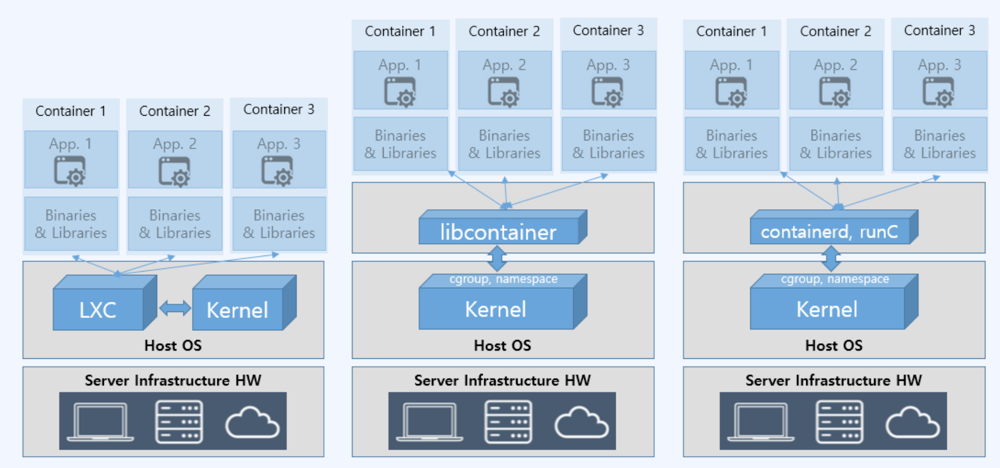
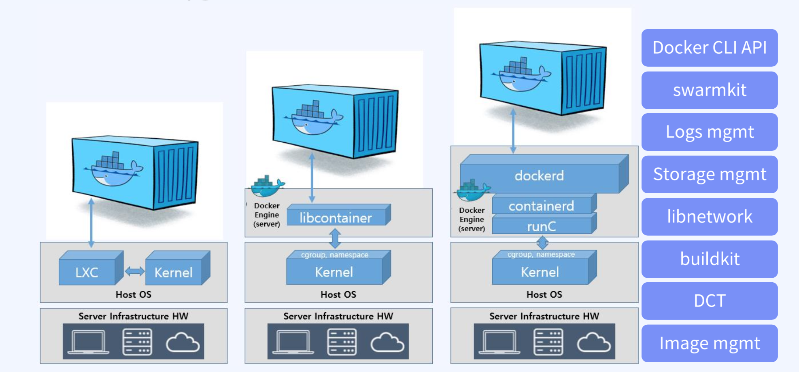

# 컨테이너 트렌드 역사

- 1991~: Linux 프로세스 격리
- 2010~: VM 가상화 기술
- 2013~: Container 가상화 기술
- 2015~: Container Orchestration tool

# 가상화란?

- 일반적으로 서버, 스토리지, 네트워크, 애플리케이션 등을 가상화하여 하드웨어 리소스를 효율적으로 사용하는데 그 목적이 있다. 이를 통해 기업은 효율적인 자원활용, 자동화된 IT 관리, 빠른 재해 복구 등의 장점을 갖을 수 있다.
- 물리적 하드웨어 유지 관리 대신 소프트웨어적으로 추상화된 가상화를 통해 제한된 부분을 쉽게 관리하고 유지할 수 있다.
- 하이퍼바이저 기반의 가상머신(VM)을 통해 수행한다.
  - Vmware, VirtualBox 등

# 컨테이너 가상화 vs VM 가상화

- 2가지 가상화 모두 실행하고자 하는 애플리케이션 프로세스 및 종속 요소와 소스 등을 패키지화(이미지화)하여 HostOS와 격리된 환경을 제공한다.
  - VM의 이미지 가상화 기술: OVF
  - Container 이미지 가상화 기술: OCI
- VM 가상화는 실제 호스트 운영체제와 같이 별도의 GuestOS를 두고 원하는 애플리케이션을 설치하는 하드웨어 수준의 가상화를 구현하고, 컨테이너 가상화는 VM 가상화에 비해 경량이면서 호스트 운영체제의 커널을 공유하는 운영체제 수준의 가상화를 구현한다.

  - GuestOS에는 커널이 있다.(Booting이 존재) > 하드웨어 수준의 가상화

- 따라서, 컨테이너 가상화는 원하는 애플리케이션 환경을 빠르게 번들링하여 패키징한다.

# 서버 vs 가상머신 vs 컨테이너

### 애플리케이션 배포 방식 비교

# 컨테이너화

- 리눅스 컨테이너 기술은 LXC(LinuX Container)를 이용한 시스템 컨테이너화로 시작
  - OS 수준의 가상화 도구
  - cgroup, namespace 등의 커널 기술을 공유하여 컨테이너에 제공
- 이후 애플리케이션 컨테이너 기반의 Docker 출시가 되었고, 초기 Docker 버전은 LXC를 활용해 컨테이너를 생성
- 지속된 컨테이너 엔진의 발전으로 Docker는 containerd, runC를 이용하는 방식으로 변경
  - 커널 기술의 공유를 통해 컨테이너 생성을 지원하는 runC
    - 호스트에 있는 커널 값 자체 cgroup, namespace를 공유받아서 컨테이너를 만드는 기술
  - 생성된 컨테이너의 라이프사이클 관리를 지원하는 containerd
  - 사용자 환경에서의 명령을 전달하는 dockerd

### 컨테이너화 기술 발전과정

### dockerd 기능

dockerd의 업무

- docker cli
- swarmkit
- logs mgmt
- storage mgmt
- libnetwork
- buildkit
- DCT
- Image mgmt
