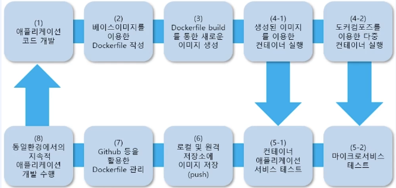
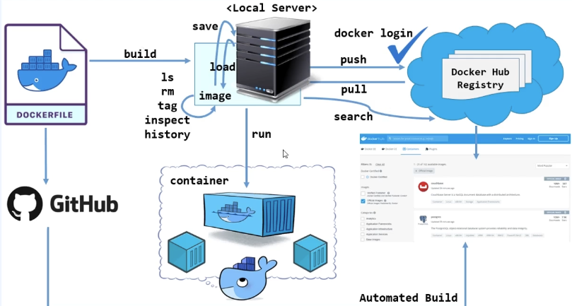

# Docker image 이해와 구조 확인

## Docker 컨테이너 서비스를 위한 image

이미지는 컨테이너의 인프라와 동일하다.  
docker image는 컨테이너 런타임에 필요한 바이너리, 라이브러리 및 설정 값등을 포함하고, 변경되는 상태값을 보유하지 않고(stateless) 변하지 않는다(Immutable, Read-only)  
일반적인 컨테이너 애플리케이션 서비스 개발 과정ㅇ 이해를 통해 image를 이해할 수 있다.

## docker image 관련 명령어

#### 이미지 내려받기

docker [image] pull [options] name:[tag]

- 기본 tag: lastest
  - tag: 주소를 명시하는 작업
- ECR로부터 다운로드 받으려면?
  - docker pull 192.168.46.101:5000/debian:10

#### 이미지 구조 확인

이미지는 레이어 구조로 되어 있다. 다른 이미지에서 사용중인 레이어를 재사용 가능하게 되어 시간/공간적으로 효율성을 높일 수 있다.

docker image inspect: 생성된 image의 내부 구조 정보를 JSON 형태로 제공

- 필요한 속성만 볼 수도 있다.

  - docker inspect --format="{{.OS}}" httpd:2.4
  - docker inspect --format="{{.ContainerConfig.ExposedPorts}}" httpd:2.4
  - docker inspect --format="{{.ContainerConfig.ExposedPorts}} {{.Os}}" httpd:2.4

- 주요 정보
  - imageID: Id
  - 생성일: Created
  - Docker 버전: DockerVersion
  - CPU 아키텍처: Architecture
  - 이미지 다이제스트 정보: RootFS
  - 이미지 레이어 저장 정보: GraphDriver
  - Container: 이미지는 수정이 안된다. 이미지를 빌드하는 과정에서 컨테이너를 만든다. 컨테이너로 만들어놓고 적용하고자 하는 범위를 적용한 후, 도커 커밋 명령을 통해 신규 이미지를 만든다. 도커에 있는 명령어 개수(스텝수)만큼 이미지, 컨테이너를 반복한다.

Docker 이미지 = 일종의 템플릿입니다.

- 이미지는 **변경 불가능(immutable)**하며,
- 이미지를 기반으로 컨테이너를 만들면, 그 컨테이너는 실행 가능한 상태가 되고,
- 컨테이너 안에서는 파일 수정, 패키지 설치 등이 가능합니다.

docker commit 명령을 통해 컨테이너의 현재 상태를 스냅샷으로 저장한 새로운 이미지가 만들어진다.

Docker는 Dockerfile에서 각 명령어(RUN, COPY, etc)를 실행할 때마다: 1. 이미지 → 컨테이너 만들고 2. 명령 실행하고 3. 결과를 저장해서 새로운 이미지 레이어 생성

예시

- docker image inspect httpd:2.4
  - 전체 내용을 보려면?
    - docker image inspect httpd:2.4 --no-trunc
  - 다운받아보려면?
    - docker image inspect httpd:2.4 --no-trunc > httpd24.txt

docker image history: docker image는 Dockerfile을 통해 build된다. history는 이 정보를 제공한다.

이미지는 Layer 구조이며, 다운로드된 Layer들은 distribution ID를 부여받고 docker 전용 경로에 저장된다.

- /var/lib/docker/image/overlay2/distribution/diffid-by-digest/sha256
- 이미지는 불변 (read only) 형태로 만들어지고, docker run 명령으로 실행하면, 이미지에 대한 스냅샷이 컨테이너 내부에 저장된다. 컨테이너가 실행되면(생성되면) read write가 가능한 컨테이너 레이어가 생성된다.
  - 컨테이너 레이어: Read Write
    - docker commit을 하면 컨테이너 내부에서 조작된 변경된 정보를 포함하여 신규 이미지가 만들어진다.
  - 이미지: Read Only
- 여러 개의 Layer를 하나의 FS로 사용하게 해주는 기능을 UFS(Union FileSystem)이라고 한다.
  - 여러개 계층을 하나로 합침