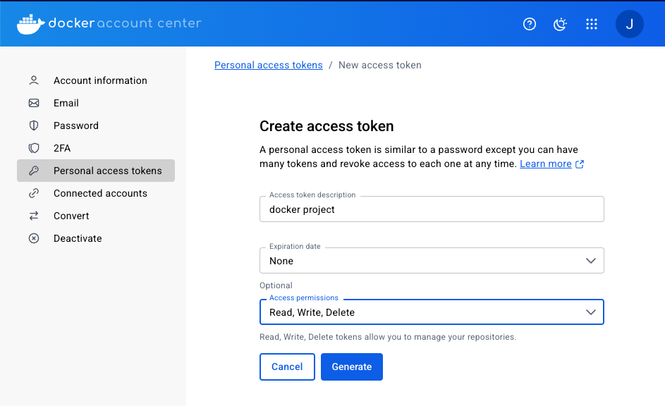
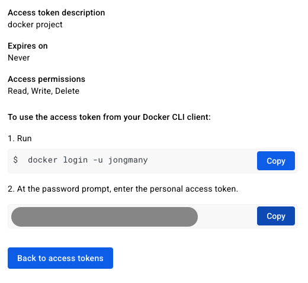
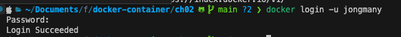

# Docker Hub Repository에 image push

## 이미지 올리기 (Push)

- Docker file을 통해 생성된 이미지나 docker commit을 통해 생성된 이미지를 저장하는 곳을 registry라고 한다.

- Registry는 공개적으로 사용하는 Public Registry와 회사 내부에서만 접근되도록 하는 Private Registry가 있다.

#### Docker push를 수행하며녀 다음과 같은 작업이 전제된다.

- 1. docker login: hub.docker.com에 가입된 본의 ID와 암호로 현재 로컬에 계정을 등록한다. (해제는 docker logout)
- 2. docker tag: hub.docker.com에 본인 계정의 Repository에 넣기 위한 태그를 수행한다. (tag는 이미지의 새로운 참조명을 넣는 방법. 간혹, OS 버전 표시로 활용하기도 한다.)

## docker login/logout

- hub.docker.com에 회원가입 후 서버에서 docker login을 통해 본인 저장소에 업로드 한다.
- Docker는 3가지 접근 방법을 제공한다.

#### 암호로 접근하는 방법

docker login

로그인시 비밀번호 암호화 방식이 base64로 되어 있음

```
echo 'welcome fastcampus' | base64

echo d2VsY29tZSBmYXN0Y2FtcHVzCg== | base64 -d
```

#### 토큰 기법 접근하는 방법

- docker hub > account setting > personal access token
  
  

```
docker login -u jongmany

토큰 정보 입력
```



토큰 정보 보관해서 로그인 하는 방법

```
vi .access_token

토큰 정보

cat .access_token | docker login --username jongmany --password-stdin
```

## docker [image] tag -> push

- hub.docker.com에 본인 계정의 Repositories에 생성한 이미지를 업로드하기 위해서는 본인 계정을 이미지명 앞에 붙여야 docker push 수행 시 계정으로 찾아가 저장된다.

```
docker image tag myweb:v1.0 jongmany/myweb:v1.0
docker images | grep myweb

myweb           v1.0   4fa889faddeb   43 hours ago    62.7MB
jongmany/myweb  v1.0   4fa889faddeb   43 hours ago    62.7MB
```

tag는 주소를 명시하는 역할만 한다.

```
docker push jongmany/myweb:v1.0
```

#### 이미지를 공유하는 방법

- registry에 push하여 공유
- 이미지를 생성하는 Dockerfile과 소스를 Github에 올려 공유
- 이미지를 docker save를 통해 파일로 백업하여 전달 후, docker load를 통해 공유

### docker image 백업 및 이전

- docker save 명령을 통해 Layer로 구성된 이미지를 \*.tar 파일로 묶어 파일로 저장
- 해당 파일을 전달받은 컴퓨터에서 docker load를 통해 이미지로 등록

```
# 파일 압축
docker image save phpserver:1.0 > phpserver1.tar

docker image save phpserver:1.0 | gzip > phpserver1.tar.gz

docker image save phpserver:1.0 | bzip2 > phpserver1.tar.bz2

ls -lh

# 다른 서버로 전달
scp phpserver1.tar.gz kevin@hostos2:/home/kevin/backup/phpserver1.tar.gz
(다른 서버에서)
docker image load < phpserver1.tar.gz
docker images
docker run -itd -p 8200:80 phpserver:1.0
```

## 도커 이미지 삭제

- 이미지를 계속 다운로드만 받게 되면 로컬 서버의 저장 용량을 많이 차지하여 공간 부족과 같은 문제를 야기하기도 한다.
- docker image save를 통해 이미지를 백업하거나 주기적으로 업무에 사용하는 이미지와 사용하지 않는 이미지를 구분하여 관리하고 불필요한 이미지는 삭제하는 것이 좋다.

```
docker image rm [옵션] {이미지명[:태그] | 이미지ID}
docker rmi [옵션] {이미지명[:태그] | 이미지ID}

# 이미지 전체 삭제
docker rmi $(docker images -q)

# 특정 이미지명이 포함된 것만 삭제
docker rmi $(docker images | grep debian)

# 특정 이미지명이 포함된 것만 제외하고 모두 삭제
docker rmi $(docker images | grep -v centio)

# 자주 사용하는 명령등을 전역 alias로 적용하여 활용하면 편리
vi .bashrc
## 상태가 exited인 container를 찾아서 모두 삭제
alias cexrm='docker rm $(docker ps --filter 'status=exited' -a -q)'
# 설정한 alias를 적용하고 확인
source .bashrc
alias

docker rmi myweb:v1.0
```

- docker images -q는 이미지 id만 가져오는 명령어다
- 컨테이너가 실행 중인 경우 해당 이미지는 삭제할 수 없다.
  - 컨테이너는 이미지의 스냅샷을 통해 만들어지고, 거기에 프로세스 레이어를 붙인 구조다.

#### 실행 중인 컨테이너 종료시키고, 삭제한 후에 이미지 삭제하기

```
docker run -d -p 8001:80 --name=myweb myweb:v1.0

docker ps
CONTAINER ID   IMAGE        COMMAND                  CREATED         STATUS         PORTS                  NAMES
57a74e197859   myweb:v1.0   "/docker-entrypoint.…"   6 seconds ago   Up 5 seconds   0.0.0.0:8001->80/tcp   myweb

# 컨테이너가 돌아가고 있는데도 삭제됨...?
docker rmi myweb:v1.0
Untagged: myweb:v1.0
# 그러나 컨테이너가 참조 중인 이미지는 myweb:v1.0이 아닌 jongmany/myweb:v1.0

docker images | grep myweb
jongmany/myweb                            v1.0

# 이미지 삭제 - 에러
docker rmi jongmany/myweb:v1.0
Error response from daemon: conflict: unable to delete jongmany/myweb:v1.0 (must be forced) - container 57a74e197859 is using its referenced image 4fa889faddeb

# 컨테이너 멈추기
docker stop 57a74e197859
57a74e197859

# 이미지 삭제 - 에러
docker rmi jongmany/myweb:v1.0
Error response from daemon: conflict: unable to delete jongmany/myweb:v1.0 (must be forced) - container 57a74e197859 is using its referenced image 4fa889faddeb

# 컨테이너 삭제하기
docker rm 57a74e197859

# 이미지 삭제 - 성공
docker rmi jongmany/myweb:v1.0
Untagged: jongmany/myweb:v1.0
Deleted: sha256:4fa889faddeb4eeacf3ef938a259f27febcf774a32feacab63e862284f13c01a
```

- 컨테이너를 멈추는 것 뿐만 아니라 삭제해야 한다.
